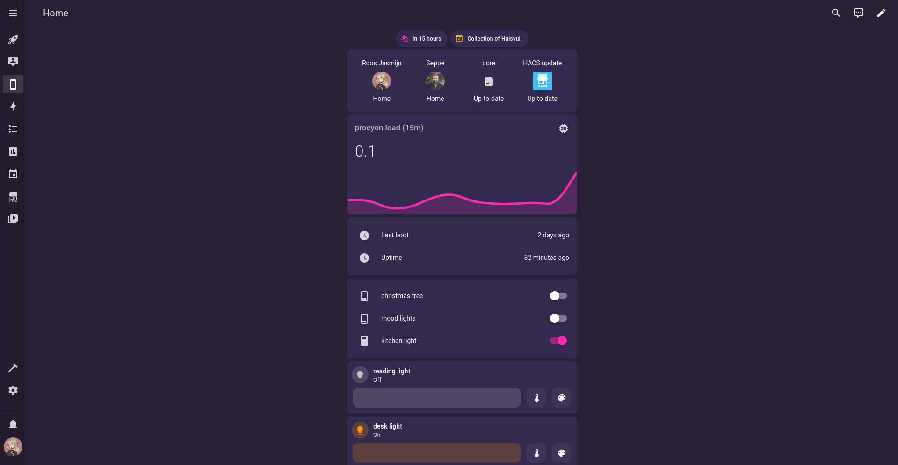

# Malibu-Point-HA
Home-Assistant Configuration for the Malibu Point infrastructure.
Malibu Point is an IoT infrastructure deployed on a personal computer network called zoo-net.
It's part of my overall IT infrastructure called zoo.
Most of the config file is split up into different components that can be found in the `includes/` directory.
Look down below for more information!

## Screenshots

### Mobile View


### aslan Network View


### reinaart Network View


## Naming System
Malibu Point makes use of an unusual naming system, this is mostly because I oftentimes make completely custom components or use devices that aren't typically used in a smart home.
The Naming System is based on animal taxonomy, see [Zoo ArchiMate](https://github.com/Frostielocks/Zoo-ArchiMate) for more information.

* Amphibians: Actual IoT devices.
* Mammals: represent more traditional computing devices.
* Birds: mobile devices.
* Sea Creatures: network devices (routers, switches, etc.).
* Reptilians: storage devices (usbs, sd-cards, etc.).

## Lovelace
TBD

### Configuration
See `lovelace-ui.yaml`

### Integrations
Configured in UI

## Home Assistant Community Store (HACS)
Configured in UI

## Installing and Updating Home Assistant via docker
```
(For Installing, only steps 3 and 4 are important)
1. docker stop home-assistant
2. docker rm home-assistant
3. docker pull homeassistant/home-assistant
4. docker run -d --network=host --name home-assistant -v <path_to_config_folder>:/config  homeassistant/home-assistant
```
